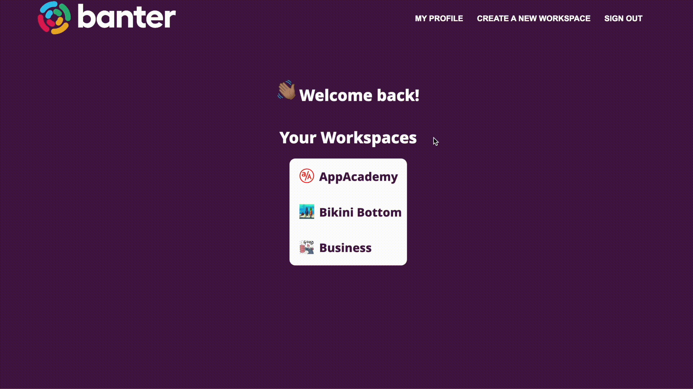
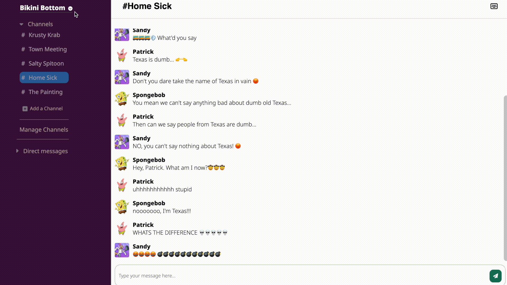

<!-- 

  <h1><a href="https://banter-k9ts.onrender.com/">Banter</a></h1>

 -->
<!-- 

  

 -->

  <picture>
    <source
      height="80"
      loop
      srcset="./react-app/src/media/banter-logo-gif-dark.gif"
      media="(prefers-color-scheme: dark)"
    />
    <source
        srcset="./react-app/src/media/banter-logo-gif-light-short.gif"
       media="(prefers-color-scheme: light), (prefers-color-scheme: no-preference)"
    />
    
  </picture>

<h1 align="center"> </h1>

 
  

- Welcome to <a align="center" href="https://banter-k9ts.onrender.com/">Banter</a>, a state-of-the-art collaboration tool that takes inspiration from Slack and harnesses the full power of Websockets, React, Redux, Flask, and SQLAlchemy. Crafted by a team of four exceptional developers, Banter sets out to create an effortless and effective platform for team communication and collaboration.

- With Banter, users can experience lightning-fast, real-time messaging capabilities, thanks to the power of Websockets. This feature allows multiple team members to stay up-to-date with each other's progress, leading to a highly productive and engaged team. Moreover, Banter leverages the power of React and Redux to provide swift updates with every re-render, ensuring seamless and uninterrupted communication between users. These cutting-edge technologies also allow for efficient state management and a user-friendly interface.

- As a team collaboration project, we approached Banter with a unified mindset, working closely to pair program, communicate, and plan. We tackled merge conflicts, debugged each other's code, and crafted an innovative design that sets Banter apart. We hope you check it out!

<h2 align="center">Landing Page</h2>

 
<h2 align="center">Workspaces</h2>

<h2 align="center">Channels</h2>

<h2 align="center">Add Users to Workspaces or Channels</h2>

<h2 align="center">Banter <a href="https://github.com/cleggie66/banter/wiki/Feature-List">Feature List</a></h2>

- Full CRUD Users
- Full CRUD Messages
- Full CRUD Channels
- Partial CR Workspaces
- Search Users feature
- Websocket implementation via Socket.io

<h2 align="center">Future Implementation Goals</h2>

- 🔔 notifications
- 🧑‍💻 admin roles
- 🟢 user status
- 🪪 user popup card
- 👍 message reactions
- ⏱️ message timestamps
- 🌎 user location

<h2 align="center">Connect with Us! </h2>

  

  

  

  

